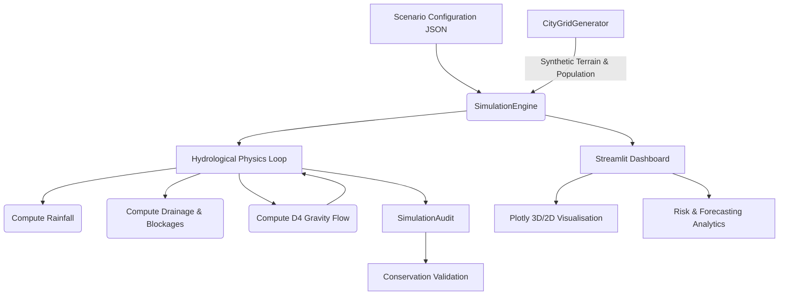

# FLOWSHIELD 🌊
**Emergency Flood Forecasting & Risk Analytics Platform**

FLOWSHIELD is a deterministic hydrological cellular automaton engine built for real-time urban flood simulation and emergency response. It models rainfall infiltration, drainage outflow, and vectorised lateral surface flow across synthetic topographical grids. 

Paired with a Streamlit and Plotly interactive operations dashboard, it enables disaster management teams to anticipate critical failure points, estimate populations at risk, and plan interventions dynamically.

---

## 🛠 Technologies Used

- **Python**: Core programming language.
- **NumPy**: Vectorized grid calculations and high-performance hydrological simulation.
- **SciPy**: Bilinear interpolation and scaling of spatial datasets.
- **Streamlit**: Interactive web application framework for the operations dashboard.
- **Plotly**: Interactive 2D heatmaps and 3D terrain/flood visualizations.
- **Pydantic**: Strong typing, data validation, and configuration management.
- **Pytest**: Unit testing framework verifying mass-conservation and physics logic.
- **Requests**: HTTP library for fetching real-world data from external APIs (Open-Meteo, WorldPop).

---
## 🏗 Architecture & Data Flow



## 🧮 Mathematical Hydrology & Mass Balance

The simulation physics are driven by a mass-conserving timestep loop. For any cell $i$ at time $t$:

$$
h_i(t+1) = h_i(t) + R_i(t) - \min(h_i(t) + R_i(t), D_i) + \sum_{j \in N(i)} F_{j \to i}
$$

Where:
- $h_i(t)$ = Surface water depth (m)
- $R_i(t)$ = Rainfall accumulation during timestep (m)
- $D_i$ = Drainage capacity for cell (m/step)
- $F_{j \to i}$ = Net lateral volume transfer from neighbor $j$ to $i$ (D4 routing towards lowest hydraulic head)

### Strict Conservation Guarantee
At every step, the system verifies total mass balance using the identity:
$V_{surface} \equiv V_{initial} + V_{rain} - V_{drained}$

## 🚀 Installation & Reproduction

1. **Clone and Setup**
   ```bash
   git clone <your-repo-link>
   cd flowshield
   python -m venv venv
   source venv/bin/activate  # Or venv\Scripts\activate on Windows
   pip install -r requirements.txt
   ```

2. **Run Validation Suite**
   Ensure the physics engine is mathematically sound:
   ```bash
   python -m pytest tests/ -v
   ```

3. **Launch Operations Dashboard**
   ```bash
   streamlit run app.py
   ```

## 📊 Scenario Benchmarks & Performance

FLOWSHIELD's vectorised NumPy engine is highly optimized for performance, enabling sub-second simulation of hours of rainfall across thousands of cells.

| Grid Size | Timesteps | Elapsed Time (s) | Memory |
|-----------|-----------|------------------|--------|
| 20 x 20   | 120       | 0.0117           | Stable |
| 50 x 50   | 120       | 0.0189           | Stable |
| 100 x 100 | 120       | 0.0429           | Stable |

*Tests conducted on Python 3.12, 120-minute simulation duration.*

### Pre-packaged Scenarios:
1. **Normal Rainfall:** Baseline 20 mm/hr test.
2. **Cloudburst Surge:** 60 mm/hr jumping by 2.5x mid-event. Tests critical mass scaling.
3. **Drainage Failure:** Pump systems degraded to 2 mm/hr. Evaluates persistent accumulation.
4. **Blocked Culvert:** Simulates a localized terrain blockage in the central valley corridor.

## 🔬 Scientific Transparency Disclaimer

> [!WARNING]
> **Simulation vs. Operational Forecast**
> FLOWSHIELD is a deterministic hackathon prototype. While the core physics adhere to strict mass-balance and gravity flow constraints, it relies on synthetic topographic generation and simplified D4 flow mechanics. It is **not** currently calibrated against real-world LIDAR topologies or hydrodynamic models (like SWMM). Do not use this tool for active life-safety operations without rigorous calibration to empirical geographical datasets.

---

## 🎬 90-Second Demo Video Script

**[0:00 - 0:15] Introduction (Face to camera / Screen sharing Dashboard)**
"Welcome to FLOWSHIELD, an emergency flood forecasting platform designed for disaster response teams. Today, urban flooding is unpredictable and fast. We need a tool that anticipates exactly *where* water will accumulate, and *who* is at risk."

**[0:15 - 0:35] Core Dashboard Walkthrough (Pan across KPI Cards & 3D Map)**
"Here is the command center. At the top, live KPIs track safe, warning, and critical regions, along with total population exposure. In the center, our interactive Plotly 3D map visualizes the topographic grid layered dynamically with rising floodwaters."

**[0:35 - 0:55] Running a Scenario (Select 'Cloudburst Surge' -> Play Simulation)**
"Let's run a 'Cloudburst Surge'. Our vectorized Python physics engine processes 120 minutes of extreme rainfall in milliseconds. As I scrub the timeline, notice how water drains from the peaks and pools in the central valley. The Risk Analytics engine is continuously forecasting 'Time-to-Critical' for every cell."

**[0:55 - 1:15] Interactivity & Analytics (Trigger 'Blocked Culvert' & Early Warning Table)**
"What if the central drainage fails? We can inject a blockage via the sidebar. Watch the flood paths alter instantly. Our Early Warning Table immediately flags new regions entering critical status, giving responders exact coordinates and ETA before overflow."

**[1:15 - 1:30] Trust & Verification (Highlight 'PASS' Badge and Water Balance Chart)**
"Finally, in mission-critical software, physics must be perfect. Our strict mass-balance validation guarantees that every drop of rain is accounted for. Thank you for watching."

## References & Attribution

FLOWSHIELD uses third-party libraries, published methodologies, and documented algorithms where applicable. See: REFERENCES.md

## Code Attribution

Externally sourced code and methodologies are identified in the source files and documented in REFERENCES.md.

Original FLOWSHIELD implementations are explicitly marked as such.
